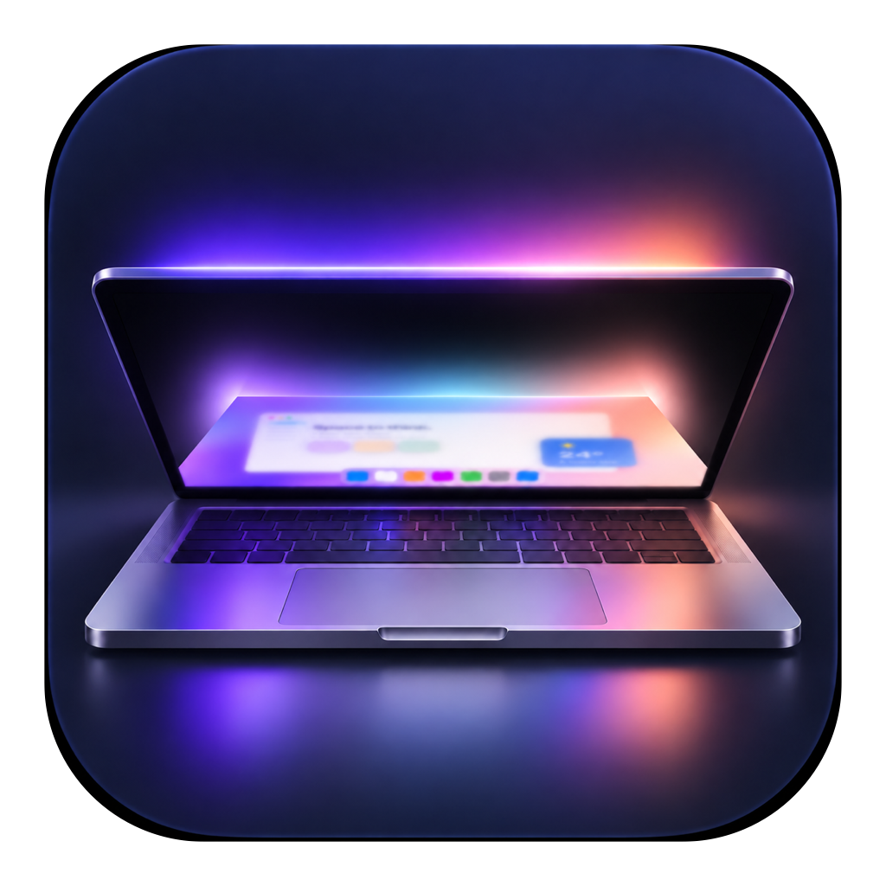
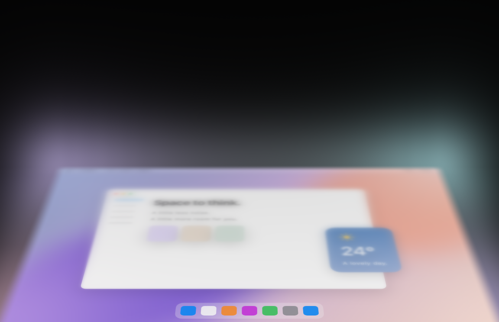
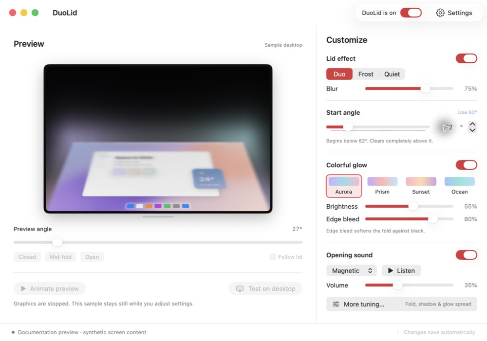

<p align="center">
  
</p>
<h1 align="center">DuoLid</h1>
<p align="center">A softer landing for your MacBook.</p>
<p align="center"><sub>Native macOS app · Apple silicon &amp; Intel · Open source · MIT</sub></p>

<!-- DUOLID-DOWNLOAD:START -->
<p align="center">
  
</p>
<p align="center"><sub>0.9.0-beta.1 is in preparation. <a href="#availability">Release status</a> · <a href="https://github.com/thetejasagrawal/DuoLid/releases">All releases</a></sub></p>
<!-- DUOLID-DOWNLOAD:END -->

<p align="center">
  <a href="#make-it-yours">Customize</a> ·
  <a href="#get-started">Get started</a> ·
  <a href="docs/COMPATIBILITY.md">Compatibility</a> ·
  <a href="#build-from-source">Build from source</a>
</p>

<p align="center">
  <a href="docs/assets/duolid-demo.mp4"></a>
</p>
<p align="center"><sub><a href="docs/assets/duolid-demo.mp4">Watch the four-second demo</a> · Synthetic content rendered by DuoLid. An appearance preview, not a live performance measurement.</sub></p>

As you lower the lid, blur travels from the top of the screen to the bottom. The desktop folds toward its lower edge, with a soft spill of light into the space behind it. Open the MacBook and a small magnetic click completes the motion.

DuoLid lives in the menu bar. At your normal open angle, the effect disappears and capture stops after its brief preparation period.

## Make it yours

| Control | Your choice |
| :--- | :--- |
| **When it begins** | Starts at **62°** by default. Adjust the slider, type an angle, or use the current lid position. |
| **Blur & fold** | Duo, Frost, or Quiet. Tune blur strength, fold depth, shadow, and smoothing. |
| **Light & color** | Soft edge bleed works on its own. Optional colorful glow adds four palettes, brightness, spread, and corner placement. **Color is off by default.** |
| **Opening sound** | Magnetic, Soft, or Crisp. Adjust volume, listen to a sample, or switch it off. |
| **Motion** | Automatic, 60 fps, or 120 fps, limited by the display. Automatic can settle at 60 for a busy fold. An optional Low Power setting uses 30 fps. |

<p align="center">
  
</p>

Preferences save automatically. Individually disabled sound and glow stay disabled after updates. Appearance, launch at login, Reduce Motion, and update preferences live in Settings.

## Get started

1. Download the verified build above when available, then drag **DuoLid** into **Applications**.
2. Open DuoLid and check its sensor and graphics status.
3. Allow **Screen Recording** for the desktop effect. If macOS asks, quit and reopen DuoLid.
4. Try the sample preview, adjust your starting angle, then close the settings window to keep DuoLid in the menu bar.

**Pause immediately:** use the menu-bar switch or **Control–Option–Command–D**. **Esc** clears a visible desktop effect.

The sample preview works without Screen Recording access. Automatic lid effects require a compatible sensor. macOS 14 or newer is required; a universal app supports both processor architectures but does not mean every MacBook exposes a usable sensor. See the [tested, unsupported, and unverified configurations](docs/COMPATIBILITY.md).

## Your screen stays yours

Screen content stays on your Mac. It is never saved, uploaded, or included in diagnostics. DuoLid captures no microphone or system audio. The opening sounds are synthesized locally. No account, analytics, or advertising SDK is included.

Update checks are optional. Sparkle contacts GitHub when you check manually or enable automatic checking; GitHub may receive ordinary connection metadata such as your IP address and user-agent. The app verifies signed feeds and archives. Silent installation and system profiling default off.

<details>
<summary><strong>Compatibility and limitations</strong></summary>

Lid sensing uses an undocumented Apple HID interface and can vary by Mac model or macOS release. Unsupported machines retain a working sample preview. External-only and mirrored display configurations are excluded.

The beta uses SDR/sRGB capture, so HDR highlights may look different while the effect is active. Protected video and the lock screen may not be capturable. DuoLid is an aesthetic effect, not a privacy lock, and it does not change macOS sleep behavior.

</details>

## Availability

The first planned release is **0.9.0-beta.1**. The download button activates only after the notarized release assets are published and verified. The current beta is still in preparation: live-capture pacing, a failed 120 fps recheck, and recovery from the previously reported pink-screen interruption remain release blockers. [Current test results](docs/release/2026-09-11-capture-scheduling.md) and [release acceptance](docs/release/acceptance.json) record the evidence; passing source tests alone is not release acceptance.

Stable **1.0.0** follows broader physical hardware testing. Downloads, release notes, source, and the signed update feed are hosted on GitHub. No separate website is needed.

## Build from source

Use Xcode with a Swift 6 toolchain. Sparkle **2.9.6** is pinned through Swift Package Manager.

```sh
git clone https://github.com/thetejasagrawal/DuoLid.git
cd DuoLid
swift test -c release -Xswiftc -warnings-as-errors
bash scripts/build.sh development
open dist/development/DuoLid.app --args --settings-only
```

The last command opens configuration without Metal previews, capture, or an overlay. Development builds use a separate identifier and never overwrite an installed copy. Open `Package.swift` in Xcode to work on the app.

Release builds require the intended Developer ID identity, a clean commit, and Xcode's Metal Toolchain. Signing and notarization stay local; CI receives no private keys. See the [release process](docs/RELEASING.md).

<details>
<summary><strong>Rendering and verification</strong></summary>

IOKit reads the hinge sensor nonexclusively. Sensor samples feed synchronized render state directly; SwiftUI angle readouts are throttled. A display-driven spring smooths steps and reversals.

ScreenCaptureKit captures the built-in display at Retina resolution and excludes DuoLid's own overlay. Dense Gaussian blur uses floating-point intermediates. Broad blur uses a filtered 2× reduction; sharp content and final output remain full resolution. The blur front moves top to bottom and the desktop rotates around its bottom edge.

A dedicated render owner limits pending GPU work and retains captured inputs until completion. The overlay is revealed only after both successful GPU completion and actual presentation. Interrupted or failed sessions are hidden and retired; undrained graphics resources remain retained until exit.

Visible diagnostics require an explicit opt-in. Keep them off a working desktop while investigating a graphics interruption. [Architecture](docs/ARCHITECTURE.md) and [verification](docs/VERIFICATION.md) document ownership, recovery, and acceptance tests.

</details>

---

[Contribute](CONTRIBUTING.md) · [Report a bug](https://github.com/thetejasagrawal/DuoLid/issues/new/choose) · [Security](SECURITY.md) · [Changelog](CHANGELOG.md) · [Reference study](docs/REFERENCE-STUDY.md)

Made by [Tejas Agrawal](https://github.com/thetejasagrawal). Released under the [MIT license](LICENSE). [Third-party notices](THIRD_PARTY_NOTICES.md).
